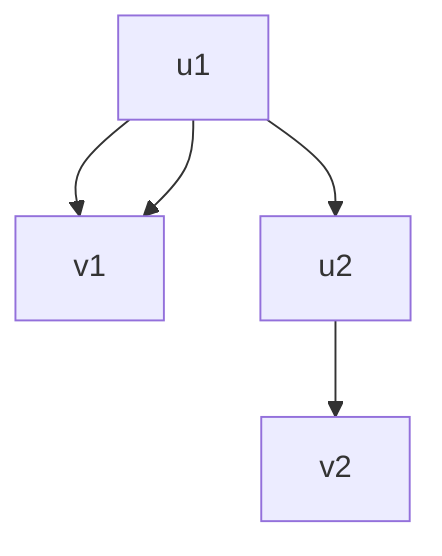

# Samuel Ma's Exam 2 Review
## Dynamic Programming
I think this is important to mention that dynamic programming is similar to divide and conquer, yet the difference is that you are building on subsolutions instead of building on subproblems.
### Fibonacci Sequence
So here is a naive way to do the nth number in the fibonacci series.
```C
int fib(int n) {
  if (n <= 1) {
    return n;
  }
  return fib(n - 1) + fib(n - 2);
}
```
The time complexity for this is O(2^n). Pretty bad lol. Inputs of just about 50 will make you see that it takes a long time. Inputs of like, 100 might not even run properly. How can we improve this?
#### Recurrence Relation (naive)
```bash
T(n) = T(n - 1) + T(n - 2) + O(1)  # Function calls and O(1) base case
```
#### Recurrence Tree

#### Dynamic Programming Implementation 1 (Top-Down)
The idea is similar to the recursive idea. We can get away with having an auxiliary data structure to hold numbers we've already seen. For example, a hashmap can work, but I'm too lazy to code it, so we're going to use an array and something that checks "hey does this exist" before going into a recursive call. 
```C
int fibonacci(int n, int memo[]) { 
    // the int array should be of size n + 1 and all of its members should start at -1
  if (n <= 1) {
    return n;
  }
  if (memo[n] != -1) { 
  // here, if we've already seen the number before, we realize that we can just get away with returning that number. 
    return memo[n];
  }
  memo[n] = fibonacci(n - 1, memo) + fibonacci(n - 2, memo);
  return memo[n]; // notice we return memo of (10) if n = 10
}

```
This idea is memorization. Important concept! We cut down the chaff and just remember subsolutions to the problem. We are building on the subsolutions of previous fib calls. 
#### New Recurrence Tree

Now our algorithm runs in O(n). 
#### Dynamic Programming Implementation 2 (Bottom-Up)
First, we have f(0) and f(1) by default. Then we calculate f(2) by adding f(1) and f(0). Then we calculate f(2) by adding f(1) and f(2). So on and so forth until f(n) is calculated with f(n - 1) and f(n - 2).
```C
algorithm BottomUpFibonacci(N):
    // INPUT
    //   N = a non-negative integer
    // OUTPUT
    //   The N-th Fibonacci number

    if N = 0 or N = 1:
        return N

    A <- 0
    B <- 1

    for I <- 2 to N:
        Temp <- A + B
        A <- B
        B <- Temp

    return B
```
This one is also O(n) but the n here is nonnegligibly smaller than the above implementation due to recursion call stacks having a lot of overhead. This implementation is considered better, at least by Badhrachalam Chitturi.
### MSS (Maximum Subarray Sum)
This one is pretty difficult for me (like most advanced algos lol), so shoot me an email or text me if you need help with this. 

<br>

The problem is:

> Given an array of integers (positive, negative, or zero), find the contiguous subarray (containing at least one number) which has the largest sum.

This is a classic **Dynamic Programming** problem and often taught via **Kadane’s Algorithm**.

### Dynamic Programming Idea:

- We define `maxEndingHere[i]` as the maximum sum of a subarray ending at position `i`.
- Recurrence relation:
  ```
  maxEndingHere[i] = max(arr[i], maxEndingHere[i-1] + arr[i])
  ```
- The idea is: at each step, either you start a new subarray at `i`, or you extend the previous subarray.

- The final answer is the maximum of all `maxEndingHere[i]`.

---

### C Implementation:

```c
#include <stdio.h>

int maxSubArraySum(int arr[], int n) {
    int maxSoFar = arr[0];
    int maxEndingHere = arr[0];

    for (int i = 1; i < n; i++) {
        // Extend or start a new subarray
        if (maxEndingHere + arr[i] > arr[i])
            maxEndingHere = maxEndingHere + arr[i];
        else
            maxEndingHere = arr[i];

        // Update max so far if needed
        if (maxEndingHere > maxSoFar)
            maxSoFar = maxEndingHere;
    }

    return maxSoFar;
}

int main() {
    int arr[] = {-2, 1, -3, 4, -1, 2, 1, -5, 4};
    int n = sizeof(arr) / sizeof(arr[0]);

    int maxSum = maxSubArraySum(arr, n);
    printf("Maximum Subarray Sum is %d\n", maxSum);

    return 0;
}
```
(You would get `6` from this because the subarray `[4, -1, 2, 1]` has the maximum sum of `6`)

### Longest Common Substring and Subsequence
I think this one is a little less intuitive because it runs in a O(n * m) where n is string 1 length and m is string 2 length. Usually, dp would give us an O(n) time complexity but we can't get much better than this. 
#### Longest Common Substring
Definition: Find the longest contiguous (i.e., continuous) substring that appears in both strings.

<br>


Dynamic Programming idea:
```bash
  Use a table dp[i][j] where dp[i][j] stores the length of the longest common substring ending at str1[i-1] and str2[j-1].
  If str1[i-1] == str2[j-1], then dp[i][j] = dp[i-1][j-1] + 1.
  Otherwise, dp[i][j] = 0.
```
```C
void longestCommonSubstring(char *str1, char *str2) {
    int n = strlen(str1);
    int m = strlen(str2);
    int dp[n+1][m+1];
    int maxLength = 0;
    int endIndex = 0; // end index in str1

    // Initialize dp table
    for (int i = 0; i <= n; i++) {
        for (int j = 0; j <= m; j++) {
            if (i == 0 || j == 0)
                dp[i][j] = 0;
            else if (str1[i-1] == str2[j-1]) {
                dp[i][j] = dp[i-1][j-1] + 1;
                if (dp[i][j] > maxLength) {
                    maxLength = dp[i][j];
                    endIndex = i;
                }
            } else
                dp[i][j] = 0;
        }
    }

    printf("Length of Longest Common Substring: %d\n", maxLength);
    printf("Longest Common Substring: ");
    for (int i = endIndex - maxLength; i < endIndex; i++) {
        printf("%c", str1[i]);
    }
    printf("\n");
}
```
You need a table of n * m size and you calculate the size of each common substring (contiguous sequence of characters) for each n and m.

#### Longest Common Subsequence
Longest Common Subsequence is the longest noncontiguous string of numbers common between two strings. What we mean here is that 'abc' and 'adc' have a longest common subsequence of 'ac'. 
```C
void longestCommonSubsequence(char *str1, char *str2) {
    int n = strlen(str1);
    int m = strlen(str2);
    int dp[n+1][m+1];

    // Fill dp table
    for (int i = 0; i <= n; i++) {
        for (int j = 0; j <= m; j++) {
            if (i == 0 || j == 0)
                dp[i][j] = 0;
            else if (str1[i-1] == str2[j-1])
                dp[i][j] = dp[i-1][j-1] + 1;
            else
                dp[i][j] = (dp[i-1][j] > dp[i][j-1]) ? dp[i-1][j] : dp[i][j-1];
        }
    }

    // Now reconstruct the sequence
    int index = dp[n][m];
    char lcs[index+1];
    lcs[index] = '\0'; // Null-terminate the string

    int i = n, j = m;
    while (i > 0 && j > 0) {
        if (str1[i-1] == str2[j-1]) {
            lcs[index-1] = str1[i-1];
            i--;
            j--;
            index--;
        } else if (dp[i-1][j] > dp[i][j-1])
            i--;
        else
            j--;
    }

    printf("Length of Longest Common Subsequence: %d\n", dp[n][m]);
    printf("Longest Common Subsequence: %s\n", lcs);
}
```
* After filling dp[i][j], you backtrack:
```bash
If str1[i-1] == str2[j-1], it’s part of LCS — add to the sequence and move diagonally (i--, j--).
Else move to the larger of dp[i-1][j] or dp[i][j-1].
```
**Important:**

You collect characters backward (from the end to start), so at the end you must reverse the sequence.

## Greedy Algorithms
The idea of a greedy algorithm is to take the best/optimal choice at the given moment. This doesn't always work for everything, so you will need to figure out when is a good time to use it and when is a bad time to use it (for example, Djikstra's algorithm with negative values doesn't work).
### 0-1 Knapsack
Chitturi's explanation of this was funny as fuck lol. Imagine you're a robber and you can only carry so much gold in your knapsack. You can take gold bar or not take the gold bar. Each gold bar has its own specific value. 

<br>

We can define the problem as:
```bash
Given n items, each with:
a weight w[i]
and a value v[i],
and a maximum weight capacity W for the knapsack,
find the maximum total value you can carry without exceeding the weight W.
```
#### C Implementation
```C
#include <stdio.h>

// Function to solve 0-1 Knapsack
int knapsack(int W, int wt[], int val[], int n) {
    int dp[n+1][W+1];

    // Build table dp[][] in bottom up manner
    for (int i = 0; i <= n; i++) {
        for (int w = 0; w <= W; w++) {
            if (i == 0 || w == 0)
                dp[i][w] = 0;
            else if (wt[i-1] <= w)
                dp[i][w] = (dp[i-1][w] > (val[i-1] + dp[i-1][w-wt[i-1]])) ? dp[i-1][w] : (val[i-1] + dp[i-1][w-wt[i-1]]);
            else
                dp[i][w] = dp[i-1][w];
        }
    }

    return dp[n][W]; // Maximum value
}

int main() {
    int val[] = {60, 100, 120};
    int wt[] = {10, 20, 30};
    int W = 50;
    int n = sizeof(val)/sizeof(val[0]);

    printf("Maximum value in Knapsack = %d\n", knapsack(W, wt, val, n));
    return 0;
}

```
max value here is 220.
#### Table

### Fractional Knapsack
This one is way greedier
# 📚 Problem Statement:

> You are given `n` items with:
> - a **weight** `w[i]`
> - and a **value** `v[i]`
>
> and a **maximum weight capacity** `W` of your bag.
> 
> **Goal:**  
> Select items to maximize the total value — but **you are allowed to take *fractions* of an item**.

✅ **Fractional allowed** → you can "break" items:
- Take **half** of an item
- Take **one-third** of an item
- etc.

---

# 🧠 Key idea:

Since you can take fractions, **greedy strategy** gives the optimal answer.

- **Pick items with the highest value-to-weight ratio first.**
- If the bag cannot fit the full item, take as much as possible (i.e., a fraction).

✅ **Greedy approach works perfectly here** (unlike 0-1 Knapsack, where greedy fails sometimes).

---

# 🔥 Step-by-Step Algorithm:

1. For each item, calculate:
   ```
   value per weight = v[i] / w[i]
   ```
2. Sort all items by **value per weight** in **decreasing** order.
3. Iterate through the items:
   - If the entire item fits (`weight <= remaining_capacity`), take it fully.
   - Otherwise, take the fraction that fits.

---

# 🛠️ Example:

Suppose:

| Item | Value | Weight | Value/Weight |
|:----:|:-----:|:------:|:------------:|
| 1    | 60    | 10     | 6            |
| 2    | 100   | 20     | 5            |
| 3    | 120   | 30     | 4            |

Bag capacity `W = 50`.

**Steps:**
- Sort by value/weight: Item 1 → Item 2 → Item 3
- Take Item 1 (weight 10) → remaining 40
- Take Item 2 (weight 20) → remaining 20
- Take **2/3** of Item 3 (because you only have room for 20 out of 30 weight).

✅ Total value:
- 60 + 100 + (120 × (20/30)) = 60 + 100 + 80 = **240**

---

# 🛠️ C Code for Fractional Knapsack:

```c
#include <stdio.h>
#include <stdlib.h>

// Structure to represent an item
typedef struct {
    int value, weight;
} Item;

// Function to compare items based on value/weight ratio
int cmp(const void *a, const void *b) {
    Item *item1 = (Item *)a;
    Item *item2 = (Item *)b;
    double r1 = (double)item1->value / item1->weight;
    double r2 = (double)item2->value / item2->weight;
    return (r1 < r2) ? 1 : -1; // Sort in decreasing order
}

double fractionalKnapsack(int W, Item arr[], int n) {
    // Sort items by value/weight ratio
    qsort(arr, n, sizeof(Item), cmp);

    double totalValue = 0.0; // Total value in knapsack

    for (int i = 0; i < n; i++) {
        if (W >= arr[i].weight) {
            W -= arr[i].weight;
            totalValue += arr[i].value;
        } else {
            totalValue += arr[i].value * ((double)W / arr[i].weight);
            break; // Bag is full
        }
    }

    return totalValue;
}

int main() {
    Item arr[] = {{60, 10}, {100, 20}, {120, 30}};
    int W = 50;
    int n = sizeof(arr)/sizeof(arr[0]);

    printf("Maximum value in Knapsack = %.2f\n", fractionalKnapsack(W, arr, n));
    return 0;
}
```

### Output:
```
Maximum value in Knapsack = 240.00
```

---

# ✨ Quick Summary

| Feature | Fractional Knapsack |
|:-------|:-------------------|
| Take full item only? | ❌ (fraction allowed) |
| Strategy type | Greedy |
| Sorting needed? | ✅ (by value/weight) |
| Time Complexity | O(n log n) (because of sorting) |
| Space Complexity | O(1) extra (ignoring sorting space) |

---

# 🚀 Visual:

Imagine you are filling a bottle with honey:

- Pick the tastiest honey first (highest "sweetness per gram").
- Keep filling.
- If space runs out, pour as much as fits.
  
That's **Fractional Knapsack**!

this is gpt generated as fuck lmao.

## Graphs
### What is a Graph?
A graph is a set of vertices connected by a set of edges. Graphs are broad and are basically the basic data structure. 
### Adjacency Lists
The length of an adjacency list is the number of vertices. An adjacency list is represented like this:
A where A is an adjacency list
A = { (u1, v1), (u2, v2) , (u1, v1), (u1, u2) }

### BFS
queue lol
### DFS
gatekeeping this cuz i am dfs man

### Prim's Algorithm MST
Greedy BFS
### Kruskal's MST
Sort everything, iterate through the list of edges, pick the smallest first and throw out anything that creates a cycle. 
### Djikstra's Algorithm
greedy, only works on nonnegative, but more efficient
### Bellman-Ford
if negative cycle, throw `false`.

